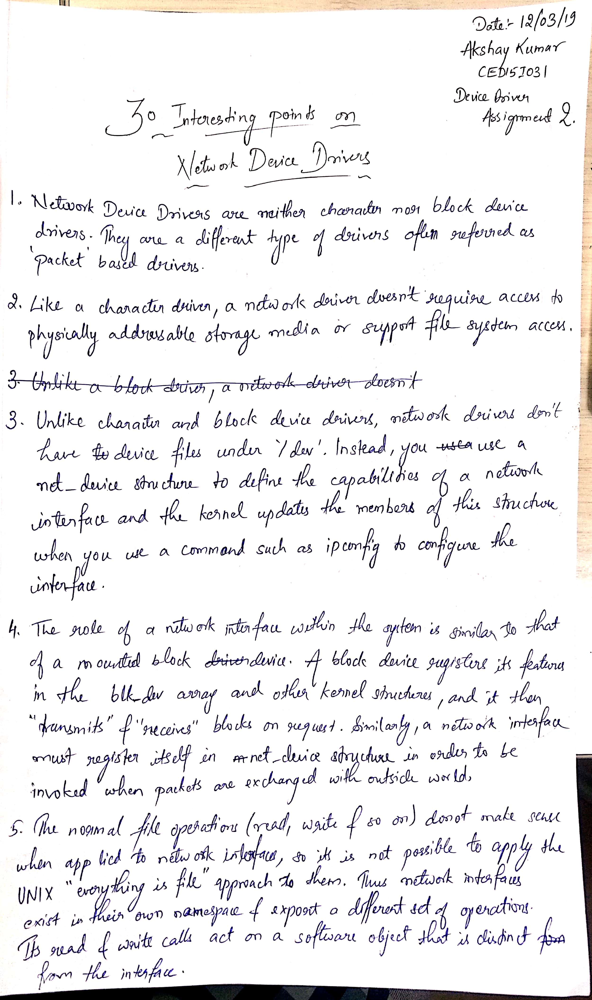
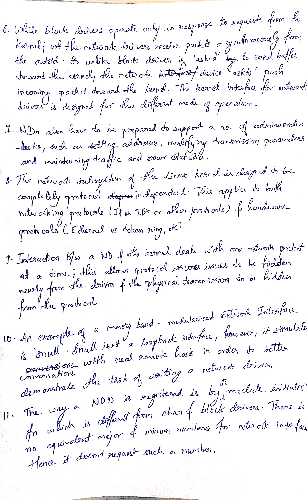
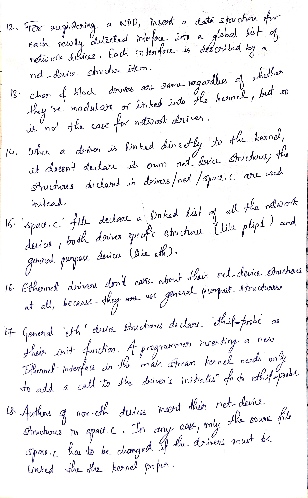
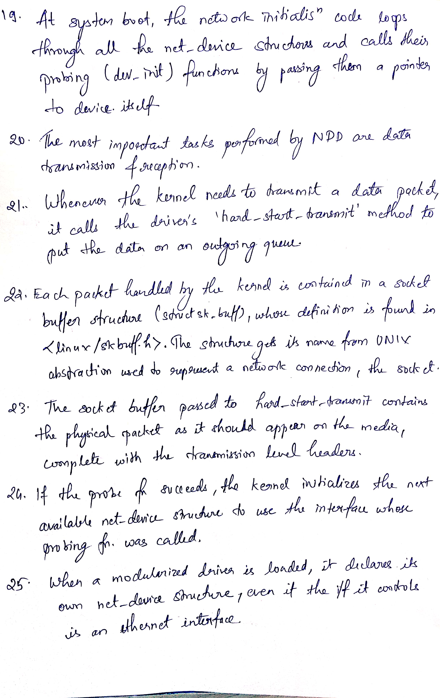
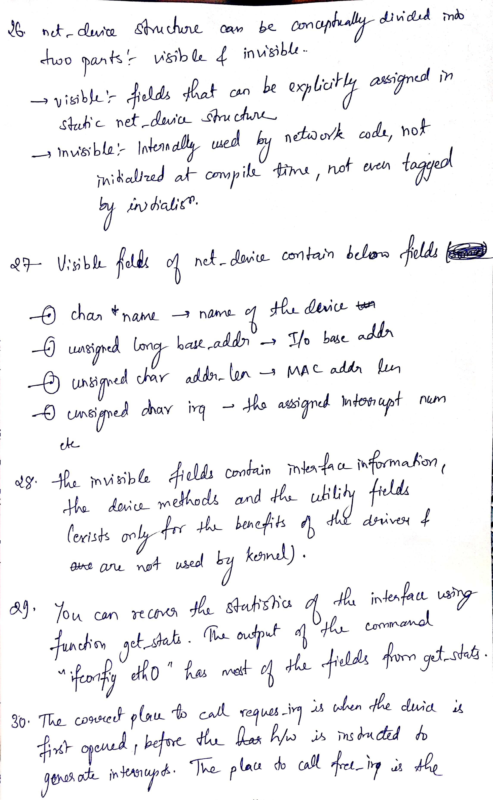
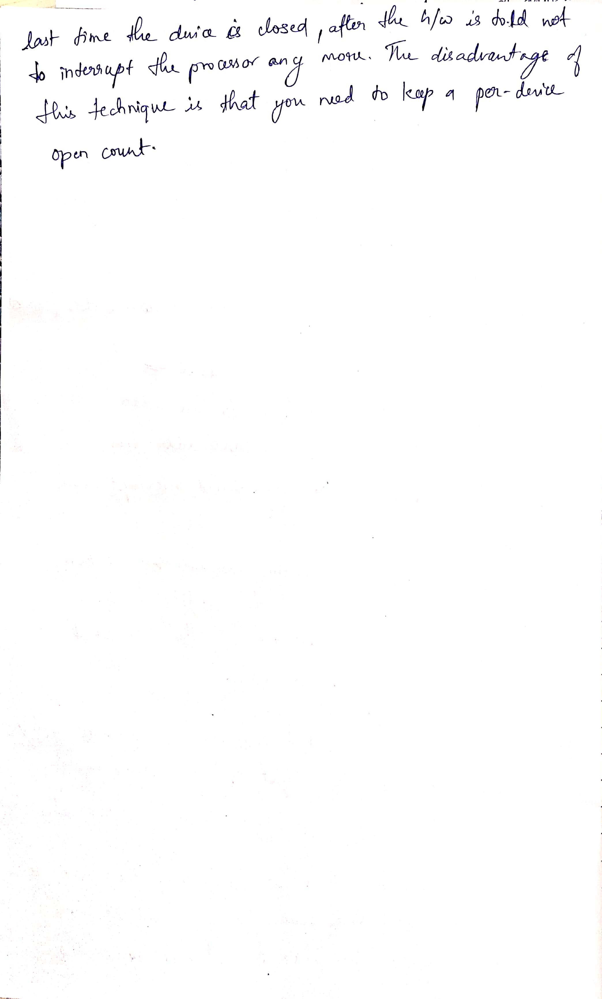

#	Network Device Drivers

##	30 Interesting points on Network Device Drivers

##	Reference
*	[About Network Device Drivers - Oracle Linux](https://docs.oracle.com/cd/E37670_01/E52461/html/ch06s07.html)
*	[Linux Device Drivers - Chapter 14](https://www.xml.com/ldd/chapter/book/ch14.html)
*	[Serial Line IP Implementation for Linux Kernel TCP/IP Stack](https://www.cse.iitb.ac.in/~bestin/btech-proj/slip/x129.html)
*	[CHAPTER 17 - Network Drivers](https://static.lwn.net/images/pdf/LDD3/ch17.pdf)